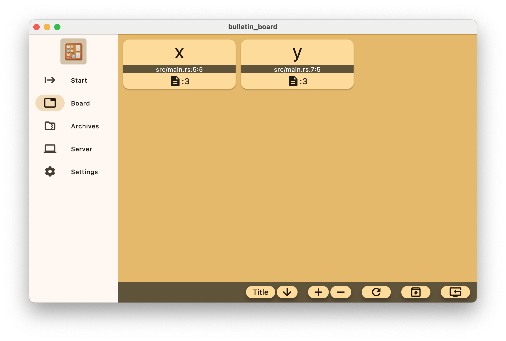

Bulletin Board GUI
===========================
[](https://www.buymeacoffee.com/YShojiHEP)

[](https://github.com/sponsors/YShoji-HEP)
[](https://github.com/YShoji-HEP/BulletinBoard/blob/main/LICENSE.txt)

GUI for `BulletinBoard`.



Highlights
----------
* Hybrid backend of memory and file, selected based on the size of the object and the allocated memory.
* Key is a combination of a title and a tag. Each key contains revisions of `ArrayObject`.
* Simple access to data. For example, revision can be omitted. Then, the most recent revision is returned. The tag can also be omitted if no other tags are present.
* The commands `archive` and `dump` make data persistent. (Data does not persist by default.)
* Unix sockets can be used with Unix-like operating systems, which makes the communication speed quite fast.

## Using Rust Inside Flutter

This project leverages Flutter for GUI and Rust for the backend logic,
utilizing the capabilities of the
[Rinf](https://pub.dev/packages/rinf) framework.

To run and build this app, you need to have
[Flutter SDK](https://docs.flutter.dev/get-started/install)
and [Rust toolchain](https://www.rust-lang.org/tools/install)
installed on your system.
You can check that your system is ready with the commands below.
Note that all the Flutter subcomponents should be installed.

```bash
rustc --version
flutter doctor
```

You also need to have the CLI tool for Rinf ready.

```bash
cargo install rinf
```

Messages sent between Dart and Rust are implemented using Protobuf.
If you have newly cloned the project repository
or made changes to the `.proto` files in the `./messages` directory,
run the following command:

```bash
rinf message
```

Now you can run and build this app just like any other Flutter projects.

```bash
flutter run
```

For detailed instructions on writing Rust and Flutter together,
please refer to Rinf's [documentation](https://rinf.cunarist.com).

